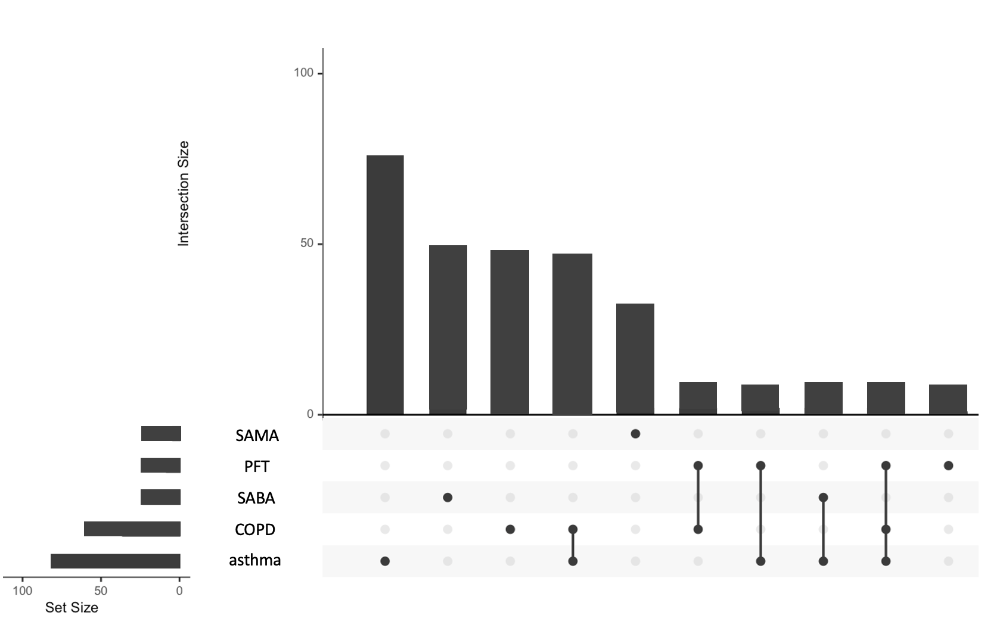

# Respiratory_screen
This project selects 130 patients with potentially persistent or worsened respiratory symptoms due to COVID-19 based on EHR records. It takes in two CSV files (with specific specifications in a separate Word file) and produces 3 tables for analysis and chart review, and an UpSet Plot

In order to run this script the institution needs to have two CSV files. The first csv_patient_list should be arranged in the following way:

| Patient Identifier   (numerical)	 | Positive COVID Date   (mm-dd-yyyy) | ICD Code or Lab    (ICD code or lab) | 
| ------ | ------ | ------ | 
|   | |  | 
|   |  | | 
|   |  | | 

The second CSV file, csv_concepts.csv should be arranged in the following manner:

| Patient Identifier   (numerical)	| Concept Code Type   (string stating one of four types of concepts 'ICD', 'CPT', 'LOINC', or 'RxNorm') | Concept Code ID   (string)	 | Column 4 Date   (mm-dd-yyyy)  |
| ------ | ------ | ------ | ------ |
|   |  | |  |
|   |  | |  |
|   |  | | 

The ICD code should be a alphanumeric format without periods    
The CPT should be in numeric format    
The RxNorm should be in numeric format     

The script produces three CSV files as output.

The first is the table for chart review ("chart_review.csv"). It will include 130 patients including their identifier, the respiratory label that flagged them as a potential respiratory symptom case, and the date of COVID: 

| patient_ID| label| COVID_date |
| ------ | ------ | ------ | 
| xxxxxxxxx | COPD | yyyy-mm-dd | 
|   |  | |  
|   |  | | 
|   |  | | 

The second is a table ("new_resp_dates,csv") of all of the new respiratory codes for each of the identified patients to help with chart review for identifying each with ongoing symptoms
| patient_ID| Concept_type| Concept_ID | Concept_date | code_label | COVID_date|
| ------ | ------ | ------ |  ------ | ------ | ------ | 
| xxxxxx | ICD |J17 | xxxx-xx-xx |COPD |xxxx-xx-xx  |  
| xxxxxx | CPT |94761 | xxxx-xx-xx  | mult_oxy |xxxx-xx-xx  |  
|   |  | |  | |  |  

The third table, "summary_stats.csv", provides summary statistics for each of the labels: 
| | total_resp_labels| new_resp_labels| new_not_old_labels |
| ------ | ------ | ------ | ------ | 
| PNA |  | |  | 
| COPD |  | |  |
| asthma |  | |  | 
| resp_failure |  | |  |
| lower_resp |  | |  | 
| resp_signs_symptoms |  | |  |
| SABA |  | |  | 
| SAMA |  | |  |
| LABA |  | |  | 
| LAMA |  | |  |
| mult_oxy |  | |  | 
| PFT |  | |  |
| PST |  | |  |

Finally, it will produce an upset figure, "resp_upset_plot.pdf",  based on new respiratory codes in your local data.  
Below is a sample with simulated data

